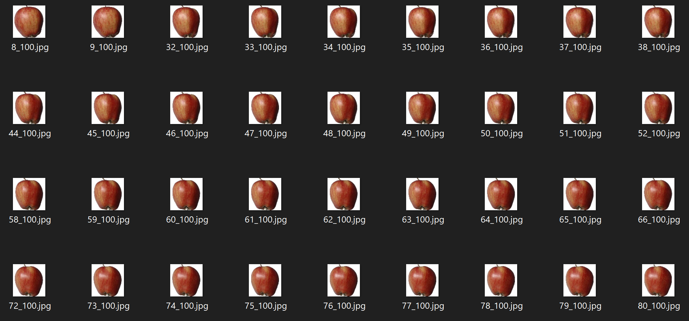

  

# Fruit Classification

This dataset1 contains 131 classes of images depicting fruits. 

The data can be used to build and train an ML model that uses image recognition to classify images of fruits.

# Structure

This repo contains the following structure:

- **Data**: contains various sub directories, each containing images for a specific fruit classification.  
- **Data/data.csv**: CSV file that maps classification labels to images.
- **fruit_sample.png**: example images from one of the apple categories:

  

The following shows a partial example of the data stored in **data.csv**:

| **image_path**                  | **target**                    |
|---------------------------------|-------------------------------|
| Apple Braeburn/321_100.jpg       | Apple Braeburn               |
| Apple Crimson Snow/103_100.jpg   | Apple Crimson Snow           |
| Grapefruit Pink/276_100.jpg      | Grapefruit Pink              |

The **image_path** lists the fruit images in the relative sub folders and the **target** column associated the 131 classification labels to the various fruits. 

# Community

Got questions, feedback, or want to join a community of machine learning practitioners working with exciting tools and projects? Check out our [Community](https://forum.perceptilabs.com/)!

1 Dataset Credits: https://www.kaggle.com/moltean/fruits

